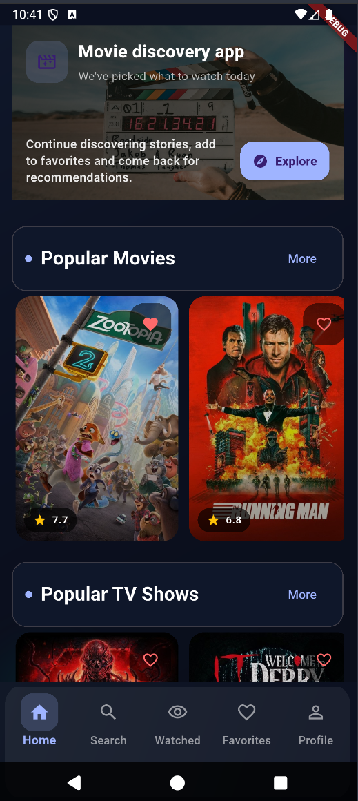
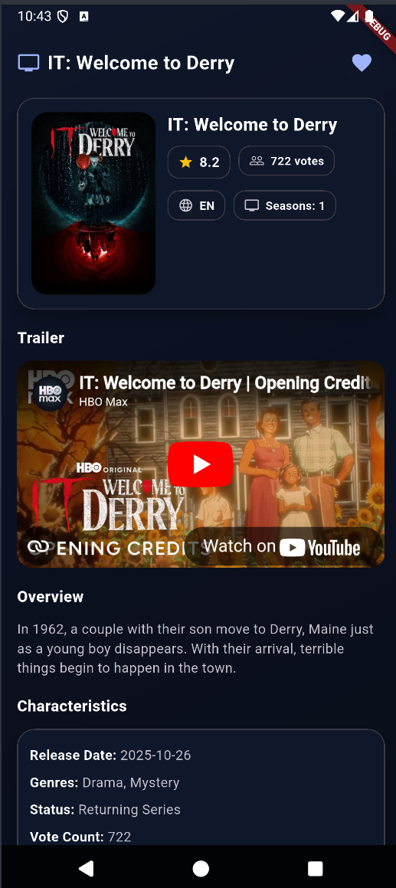
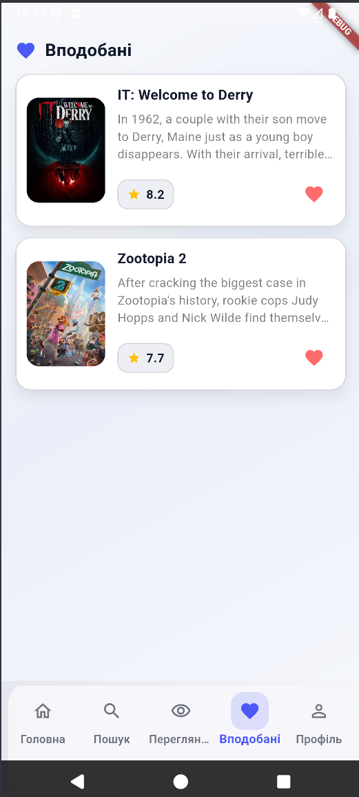
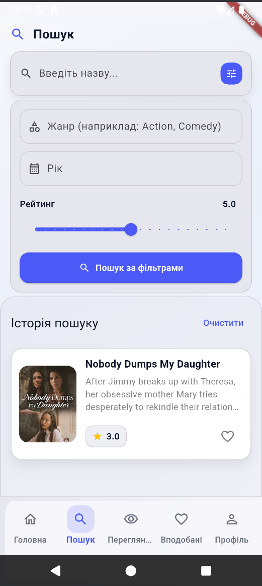
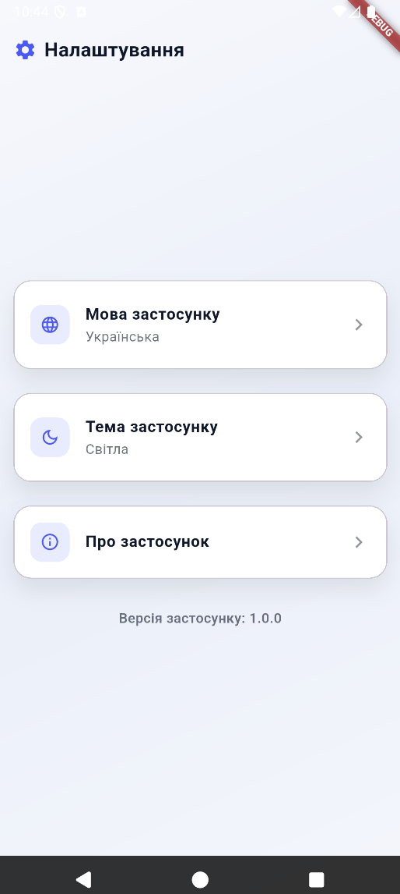

# 🎬 Movie Discovery App

Flutter додаток для пошуку та перегляду інформації про фільми та серіали з використанням The Movie Database (TMDB) API.

## 🎯 Обрана тема

**Movie Discovery App** - додаток для каталогу фільмів і серіалів з пошуком, фільтрацією та збереженням улюблених.

## 🏗️ Архітектура

Проект реалізований з використанням **Clean Architecture** з трьома шарами:

### Presentation Layer
- **BLoC/Cubit** для state management (`flutter_bloc`)
- UI компоненти (Pages, Widgets)
- State класи для кожного feature
- Material Design 3 з responsive design

### Domain Layer
- **Use Cases** для бізнес-логіки:
    - `GetPopularContentUseCase` - завантаження популярного контенту
    - `SearchMediaUseCase` - пошук медіа за назвою
    - `SearchByNameUseCase` - пошук за назвою
    - `SearchByFiltersUseCase` - пошук за фільтрами (жанр, рік, рейтинг)
    - `GetMovieDetailsUseCase` - деталі фільму
    - `GetTvDetailsUseCase` - деталі серіалу
    - `GetMovieVideosUseCase` - відео для фільму
    - `SignInUseCase` - авторизація користувача
    - `RegisterUseCase` - реєстрація користувача
    - `UpdateProfileUseCase` - оновлення профілю
    - `GetUserProfileUseCase` - отримання профілю користувача
    - `GetFavoritesUseCase` - отримання улюблених
    - `GetMediaCollectionsUseCase` - отримання колекцій
    - `ToggleFavoriteUseCase` - додавання/видалення з улюблених
    - `AddToWatchlistUseCase` - додавання до watchlist
- Domain entities (User, Movie, TvShow, Genre, MediaItem, Video)

### Data Layer
- **Repository Pattern** для всіх API calls
- Data sources:
    - `HomeApiService` - API сервіс для TMDB
    - `LocalCacheDb` (Drift) - локальне кешування
    - `MediaCollectionsStorage` (Drift) - зберігання колекцій
    - `AuthRepository` - авторизація через Drift
- Data models з мапперами для конвертації між data та domain шарами

### Dependency Injection
- **GetIt** для dependency injection
- Централізована реєстрація в `lib/core/di.dart`
- Injectable для автоматичної генерації (опціонально)

## 🌐 API Integration

### Використовувані API:
- **[The Movie Database (TMDB) API](https://www.themoviedb.org/documentation/api)** - основне джерело даних про фільми та серіали
    - Endpoints: `/movie/popular`, `/tv/popular`, `/search/movie`, `/search/tv`, `/movie/{id}`, `/tv/{id}`, `/movie/{id}/videos`, `/tv/{id}/videos`, `/movie/{id}/reviews`, `/genre/movie/list`, `/genre/tv/list`

### Особливості інтеграції:
- **HTTP client**: `Dio` package для API запитів з interceptors
- **Error handling**: обробка помилок мережі з user-friendly повідомленнями
- **Offline-first**: кешування даних в Drift базі даних через `LocalCacheDb` (TTL: 30 хвилин)
- **Interceptors**:
    - `ApiKeyInterceptor` - автоматичне додавання API ключа
    - Логування запитів та відповідей
- **Secure Storage**: збереження API ключів в `flutter_secure_storage`
- **Retry logic**: автоматичні повторні спроби при помилках мережі
- **Stale-while-revalidate**: використання застарілих даних при відсутності мережі

## 🚀 Features

### Основні функції:
- ✅ **Каталог фільмів і серіалів** - перегляд популярного контенту з пагінацією
- ✅ **Пошук** - пошук за назвою, жанром, роком, рейтингом
- ✅ **Деталі медіа** - детальна інформація про фільми/серіали з:
    - Описом та метаданими
    - Трейлерами через YouTube Player
    - Відгуками користувачів
    - Рекомендаціями
- ✅ **Favorites** - збереження улюблених фільмів та серіалів
- ✅ **Watchlist** - список для перегляду
- ✅ **Collections** - створення та управління колекціями медіа
- ✅ **Профіль користувача** - управління профілем:
    - Редагування імені та аватара
    - Зміна пароля
    - Налаштування теми (світла/темна/системна)
    - Вибір мови
- ✅ **Авторизація** - реєстрація та вхід користувачів
- ✅ **Responsive Design** - адаптивний дизайн для різних розмірів екранів

### Authentication Flow:
- Локальна авторизація через Drift базу даних
- Збереження сесії користувача
- Захищені маршрути з перевіркою авторизації
- JWT токени для безпеки

### Search & Filter Features:
- Пошук за назвою (реал-тайм)
- Фільтрація за жанрами
- Фільтрація за роком випуску
- Фільтрація за рейтингом
- Комбіновані фільтри

## 📁 Структура проекту

```
project/
├── lib/
│   ├── core/                          # Core utilities, constants, DI, base classes
│   │   ├── domain/                    # Base use case classes
│   │   │   └── base_usecase.dart      # UseCase<T, Params>, UseCaseNoParams<T>
│   │   ├── network/                   # Network configuration
│   │   │   ├── interceptors/          # Dio interceptors
│   │   │   │   ├── api_key_interceptor.dart
│   │   │   │   ├── auth_header_interceptor.dart
│   │   │   │   └── logging_interceptor.dart
│   │   │   ├── dio_client.dart        # Dio client setup
│   │   │   └── retry_helper.dart      # Retry logic for network requests
│   │   ├── storage/                   # Local storage
│   │   │   ├── auth_db.dart           # Drift DB for authentication
│   │   │   ├── local_cache_db.dart    # Drift DB for API cache
│   │   │   ├── media_collections_storage.dart  # Drift DB for collections
│   │   │   ├── secure_storage_service.dart     # Secure storage for API keys
│   │   │   └── user_prefs.dart        # Hive for user preferences
│   │   ├── auth/                      # Core auth services
│   │   │   ├── auth_method.dart
│   │   │   ├── firebase_auth_service.dart
│   │   │   └── jwt_token_service.dart
│   │   ├── app_router.dart            # App routing configuration
│   │   ├── constants.dart             # App constants
│   │   ├── di.dart                    # Dependency injection (GetIt)
│   │   ├── loading_state.dart         # Loading state utilities
│   │   ├── main_scaffold.dart         # Main app scaffold
│   │   ├── page_transitions.dart      # Page transition animations
│   │   ├── responsive.dart            # Responsive design utilities
│   │   └── theme.dart                 # App theme configuration
│   │
│   ├── features/                      # Feature modules (Clean Architecture)
│   │   ├── auth/                      # Authentication feature
│   │   │   ├── domain/
│   │   │   │   ├── entities/
│   │   │   │   │   └── user.dart      # User entity
│   │   │   │   └── usecases/
│   │   │   │       ├── sign_in_usecase.dart
│   │   │   │       └── register_usecase.dart
│   │   │   ├── data/
│   │   │   │   ├── mappers/
│   │   │   │   │   └── user_mapper.dart
│   │   │   │   └── models/
│   │   │   │       └── local_user.dart
│   │   │   ├── auth_bloc.dart         # BLoC for auth state
│   │   │   ├── auth_event.dart
│   │   │   ├── auth_state.dart
│   │   │   ├── auth_repository.dart   # Repository interface
│   │   │   └── login_page.dart        # Login UI
│   │   │
│   │   ├── home/                      # Home screen with media catalog
│   │   │   ├── domain/
│   │   │   │   ├── entities/
│   │   │   │   │   ├── genre.dart
│   │   │   │   │   ├── media_item.dart
│   │   │   │   │   ├── movie.dart
│   │   │   │   │   ├── tv_show.dart
│   │   │   │   │   └── video.dart
│   │   │   │   └── usecases/
│   │   │   │       ├── get_popular_content_usecase.dart
│   │   │   │       ├── search_media_usecase.dart
│   │   │   │       ├── search_by_name_usecase.dart
│   │   │   │       ├── get_movie_details_usecase.dart
│   │   │   │       ├── get_tv_details_usecase.dart
│   │   │   │       └── get_movie_videos_usecase.dart
│   │   │   ├── data/
│   │   │   │   ├── mappers/
│   │   │   │   │   ├── genre_mapper.dart
│   │   │   │   │   ├── media_item_mapper.dart
│   │   │   │   │   ├── movie_mapper.dart
│   │   │   │   │   └── tv_show_mapper.dart
│   │   │   │   └── models/
│   │   │   │       ├── genre_model.dart
│   │   │   │       ├── movie_model.dart
│   │   │   │       └── tv_show_model.dart
│   │   │   ├── home_api_service.dart   # API service for TMDB
│   │   │   ├── home_repository.dart    # Repository interface
│   │   │   ├── home_bloc.dart          # BLoC for home state
│   │   │   ├── home_event.dart
│   │   │   ├── home_page.dart          # Home screen UI
│   │   │   ├── media_detail_page.dart  # Media details UI
│   │   │   ├── media_list_page.dart    # Media list UI
│   │   │   ├── home_media_item.dart
│   │   │   └── widgets/
│   │   │       └── movie_trailer_player.dart
│   │   │
│   │   ├── search/                     # Search feature
│   │   │   ├── domain/
│   │   │   │   ├── repositories/
│   │   │   │   │   └── search_repository.dart
│   │   │   │   └── usecases/
│   │   │   │       └── search_by_filters_usecase.dart
│   │   │   ├── data/
│   │   │   │   └── repositories/
│   │   │   │       └── search_repository_impl.dart
│   │   │   ├── search_bloc.dart
│   │   │   ├── search_event.dart
│   │   │   ├── search_state.dart
│   │   │   └── search_page.dart
│   │   │
│   │   ├── favorites/                  # Favorites feature
│   │   │   ├── domain/
│   │   │   │   ├── repositories/
│   │   │   │   │   └── favorites_repository.dart
│   │   │   │   └── usecases/
│   │   │   │       └── get_favorites_usecase.dart
│   │   │   ├── data/
│   │   │   │   └── repositories/
│   │   │   │       └── favorites_repository_impl.dart
│   │   │   ├── favorites_bloc.dart
│   │   │   ├── favorites_event.dart
│   │   │   └── favorites_page.dart
│   │   │
│   │   ├── collections/                # Media collections feature
│   │   │   ├── domain/
│   │   │   │   ├── repositories/
│   │   │   │   │   └── media_collections_repository.dart
│   │   │   │   └── usecases/
│   │   │   │       ├── get_media_collections_usecase.dart
│   │   │   │       ├── toggle_favorite_usecase.dart
│   │   │   │       └── add_to_watchlist_usecase.dart
│   │   │   ├── media_collections_bloc.dart
│   │   │   ├── media_collections_event.dart
│   │   │   └── media_collection_entry.dart
│   │   │
│   │   ├── profile/                    # User profile feature
│   │   │   ├── domain/
│   │   │   │   ├── repositories/
│   │   │   │   │   └── profile_repository.dart
│   │   │   │   └── usecases/
│   │   │   │       ├── get_user_profile_usecase.dart
│   │   │   │       └── update_profile_usecase.dart
│   │   │   ├── data/
│   │   │   │   └── repositories/
│   │   │   │       └── profile_repository_impl.dart
│   │   │   ├── profile_bloc.dart
│   │   │   ├── profile_event.dart
│   │   │   ├── profile_page.dart
│   │   │   ├── edit_profile_page.dart
│   │   │   ├── watchlist_page.dart
│   │   │   ├── settings_page.dart
│   │   │   └── about_app_page.dart
│   │   │
│   │   └── settings/                   # App settings feature
│   │       ├── settings_bloc.dart
│   │       ├── settings_event.dart
│   │       └── settings_state.dart
│   │
│   ├── shared/                         # Shared widgets and utilities
│   │   └── widgets/
│   │       ├── animated_loading_widget.dart
│   │       ├── app_notification.dart
│   │       ├── auth_dialog.dart
│   │       ├── home_header_widget.dart
│   │       └── loading_wrapper.dart
│   │
│   ├── l10n/                           # Localization files
│   │   ├── app_en.arb
│   │   ├── app_uk.arb
│   │   ├── app_localizations.dart
│   │   ├── app_localizations_en.dart
│   │   └── app_localizations_uk.dart
│   │
│   └── main.dart                       # App entry point
│
├── test/                               # Unit + Widget tests
│   ├── unit/                           # Unit tests
│   │   ├── core/
│   │   │   ├── auth/
│   │   │   │   └── jwt_token_service_test.dart
│   │   │   └── network/
│   │   │       └── retry_helper_test.dart
│   │   ├── features/
│   │   │   ├── auth/
│   │   │   │   ├── auth_bloc_test.dart
│   │   │   │   ├── data/mappers/user_mapper_test.dart
│   │   │   │   └── domain/usecases/
│   │   │   │       ├── sign_in_usecase_test.dart
│   │   │   │       └── register_usecase_test.dart
│   │   │   ├── home/
│   │   │   │   ├── home_bloc_test.dart
│   │   │   │   ├── home_repository_test.dart
│   │   │   │   ├── data/mappers/
│   │   │   │   ├── domain/entities/
│   │   │   │   └── domain/usecases/
│   │   │   ├── search/
│   │   │   ├── favorites/
│   │   │   ├── collections/
│   │   │   ├── profile/
│   │   │   └── settings/
│   │   └── helpers/
│   │       ├── test_helpers.dart
│   │       └── widget_test_helpers.dart
│   └── widget/                         # Widget tests
│       ├── auth/
│       ├── home/
│       ├── search/
│       ├── favorites/
│       ├── profile/
│       └── shared/
│
├── integration_test/                   # E2E tests
│   ├── setup_auth_test.dart            # Setup auth (run first!)
│   ├── auth_flow_test.dart
│   ├── home_navigation_test.dart
│   ├── search_flow_test.dart
│   ├── favorites_flow_test.dart
│   ├── watchlist_flow_test.dart
│   ├── profile_flow_test.dart
│   ├── edit_profile_flow_test.dart
│   ├── settings_flow_test.dart
│   ├── media_interaction_test.dart
│   ├── content_interaction_test.dart
│   ├── navigation_flow_test.dart
│   ├── error_handling_test.dart
│   ├── responsive_behavior_test.dart
│   ├── about_app_flow_test.dart
│   ├── complete_user_journey_test.dart
│   ├── app_test.dart
│   └── helper_functions.dart
│
├── screenshots/                         # App screenshots
│   ├── img.png
│   ├── img_1.png
│   ├── img_2.png
│   ├── img_3.png
│   └── img_4.png
│
├── android/                             # Android platform files
│   ├── app/
│   │   ├── build.gradle.kts
│   │   └── proguard-rules.pro
│   └── build.gradle.kts
│
├── .github/
│   └── workflows/
│       └── flutter.yml                 # CI/CD pipeline
│
├── README.md                           # Project documentation
└── pubspec.yaml                        # Dependencies configuration
```

## 🧪 Testing

### Поточний стан:
- ✅ **Unit tests**: 53+ тестових файлів
    - Тести для BLoC/Cubit (HomeBloc, AuthBloc, SearchBloc, ProfileBloc, FavoritesBloc, SettingsBloc, MediaCollectionsBloc)
    - Тести для Use Cases (всі use cases покриті тестами)
    - Тести для Repositories (HomeRepository, AuthRepository, SearchRepository, FavoritesRepository, ProfileRepository)
    - Тести для Mappers (MovieMapper, TvShowMapper, GenreMapper, MediaItemMapper, UserMapper)
    - Тести для Entities (Movie, TvShow, MediaItem, Video, User)
    - Тести для утиліт (RetryHelper, JwtTokenService)
- ✅ **Widget tests**: 20+ тестових файлів
    - Тести для всіх основних UI компонентів
    - Тести для HomePage, MediaDetailPage, MediaListPage
    - Тести для Auth (LoginPage)
    - Тести для Profile (ProfilePage, EditProfilePage, SettingsPage, WatchlistPage)
    - Тести для Search (SearchPage)
    - Тести для Favorites (FavoritesPage)
    - Тести для shared widgets (LoadingWrapper, AppNotification, AnimatedLoadingWidget, AuthDialog)
- ✅ **Integration tests**: 18 E2E тестових файлів
    - `setup_auth_test.dart` - налаштування авторизації (запускайте першим!)
    - `auth_flow_test.dart` - повний flow авторизації
    - `home_navigation_test.dart` - навігація по головному екрану
    - `search_flow_test.dart` - пошук та фільтрація
    - `favorites_flow_test.dart` - робота з улюбленими
    - `watchlist_flow_test.dart` - робота з watchlist
    - `profile_flow_test.dart` - управління профілем
    - `edit_profile_flow_test.dart` - редагування профілю
    - `settings_flow_test.dart` - налаштування додатку
    - `media_interaction_test.dart` - взаємодія з медіа
    - `content_interaction_test.dart` - взаємодія з контентом
    - `navigation_flow_test.dart` - навігація по додатку
    - `error_handling_test.dart` - обробка помилок
    - `responsive_behavior_test.dart` - адаптивна поведінка
    - `about_app_flow_test.dart` - інформація про додаток
    - `complete_user_journey_test.dart` - повний user journey
    - `app_test.dart` - базовий тест додатку

### 🔧 Підготовка до запуску тестів

#### Крок 1: Перевірте Flutter
```bash
flutter doctor
```
Переконайтеся, що всі галочки ✅ зелені.

#### Крок 2: Встановіть залежності
```bash
flutter pub get
```

### 🧩 Unit тести (бізнес-логіка)

**Unit тести** перевіряють окремі частини коду: функції, класи, логіку обробки даних.

**Де знаходяться:** `test/unit/`

#### Спосіб 1: Запуск через Android Studio (найпростіший)

1. Відкрийте файл тесту (наприклад: `test/unit/features/auth/auth_bloc_test.dart`)
2. Знайдіть назву тесту (наприклад, `test('should emit loading state')`)
3. Клацніть правою кнопкою миші на назву тесту або на файл
4. Виберіть **"Run 'test name'"** або **"Run 'auth_bloc_test.dart'"**
5. Результати з'являться внизу екрану в панелі **Run**

#### Спосіб 2: Запуск через зелений трикутник

1. Відкрийте файл тесту
2. Подивіться на лівий бік редактора - там будуть зелені трикутники ▶️ біля назв тестів
3. Клацніть на трикутник біля потрібного тесту
4. Виберіть **"Run"** або **"Debug"**

#### Спосіб 3: Запуск через термінал

```bash
# Всі unit тести
flutter test test/unit/

# Конкретний файл
flutter test test/unit/features/auth/auth_bloc_test.dart
```

#### Що означають результати?
- ✅ **Зелені галочки** - тест пройшов успішно
- ❌ **Червоні хрестики** - тест не пройшов (є помилка)
- ⚠️ **Жовті попередження** - тест пройшов, але є попередження

### 🎨 Widget тести (UI компоненти)

**Widget тести** перевіряють, чи правильно відображаються елементи інтерфейсу (кнопки, тексти, зображення).

**Де знаходяться:** `test/widget/`

#### Спосіб 1: Запуск через Android Studio

1. Відкрийте файл тесту (наприклад: `test/widget/auth/login_page_test.dart`)
2. Клацніть правою кнопкою миші на файл або назву тесту
3. Виберіть **"Run 'login_page_test.dart'"**
4. Результати з'являться в панелі **Run**

#### Спосіб 2: Запуск через зелений трикутник

1. Відкрийте файл тесту
2. Знайдіть зелений трикутник ▶️ біля назви тесту
3. Клацніть на нього та виберіть **"Run"**

#### Спосіб 3: Запуск через термінал

```bash
# Всі widget тести
flutter test test/widget/

# Конкретний файл
flutter test test/widget/auth/login_page_test.dart
```

#### Що перевіряють Widget тести?
- ✅ Чи відображається текст на екрані
- ✅ Чи працюють кнопки
- ✅ Чи правильно відображаються зображення
- ✅ Чи правильно працює навігація

### 🚀 Integration тести (повні сценарії)

**Integration тести** перевіряють повні сценарії використання додатку - від початку до кінця, як це робить реальний користувач.

**⚠️ ВАЖЛИВО:** Integration тести **мають запускатися на Android пристрої або емуляторі**, а не на Windows!

#### Крок 1: Запустіть Android емулятор

1. В Android Studio: **Tools → Device Manager**
2. Знайдіть емулятор (наприклад, "Medium Phone 2")
3. Клацніть на ▶️ (Play) біля емулятора
4. Дочекайтеся повного завантаження емулятора

#### Крок 2: Перевірте, що пристрій підключений

```bash
flutter devices
```

Ви повинні побачити щось на кшталт:
```
emulator-5554 • sdk gphone64 arm64 • android-arm64 • Android 13 (API 33)
```

#### Крок 3: Спочатку запустіть setup тест авторизації

**ЦЕ ОБОВ'ЯЗКОВО!** Багато функцій додатку недоступні без авторизації.

**Через термінал:**
```bash
flutter test integration_test/setup_auth_test.dart -d emulator-5554
```
(Замініть `emulator-5554` на ID вашого пристрою з `flutter devices`)

**Через Android Studio:**
1. Відкрийте `integration_test/setup_auth_test.dart`
2. Клацніть правою кнопкою → **"Run 'setup_auth_test.dart'"**
3. **ВАЖЛИВО**: У верхньому меню виберіть Android пристрій замість Windows!

**Де знаходяться:** `integration_test/`

#### Спосіб 1: Запуск через Android Studio

1. Відкрийте файл тесту (наприклад: `integration_test/auth_flow_test.dart`)
2. Клацніть правою кнопкою миші на файл
3. Виберіть **"Run 'auth_flow_test.dart'"**
4. **ВАЖЛИВО**: У верхньому меню (біля кнопки Run) виберіть **Android пристрій** замість Windows!

#### Спосіб 2: Запуск через термінал (рекомендовано)

```bash
# Спочатку перевірте доступні пристрої
flutter devices

# Запустіть setup тест авторизації (ОБОВ'ЯЗКОВО першим!)
flutter test integration_test/setup_auth_test.dart -d emulator-5554

# Потім запускайте інші тести
flutter test integration_test/auth_flow_test.dart -d emulator-5554
flutter test integration_test/watchlist_flow_test.dart -d emulator-5554
flutter test integration_test/favorites_flow_test.dart -d emulator-5554
flutter test integration_test/search_flow_test.dart -d emulator-5554
flutter test integration_test/profile_flow_test.dart -d emulator-5554
```

#### Спосіб 3: Запуск всіх Integration тестів

```bash
# Спочатку setup
flutter test integration_test/setup_auth_test.dart -d emulator-5554

# Потім всі інші
flutter test integration_test/ -d emulator-5554
```

## 📱 Screenshots







## 🛠️ Setup Instructions

### Передумови:
- Flutter SDK 3.35.6 або новіша версія
- Dart SDK 3.5.0+
- Android Studio / VS Code з Flutter extensions
- Android SDK (для Android збірки)
- Java 17 (для Android збірки)

### Кроки встановлення:

1. **Клонувати репозиторій**
   ```bash
   git clone <repository-url>
   cd project
   ```

2. **Налаштувати API ключі**
    - Створити файл `.env` в корені проекту:
      ```bash
      touch .env
      ```
    - Відкрити `.env` та заповнити значення:
      ```
      TMDB_API_KEY=your_api_key_here
      AUTH_METHOD=local
      ```
    - Отримати TMDB API key: https://www.themoviedb.org/settings/api

3. **Встановити залежності**
   ```bash
   flutter pub get
   ```

4. **Згенерувати код** (якщо потрібно)
   ```bash
   flutter pub run build_runner build --delete-conflicting-outputs
   ```

5. **Запустити додаток**
   ```bash
   flutter run
   ```

### Для Android:
```bash
flutter run -d android
```

### Для release збірки з obfuscation:
```bash
flutter build apk --release --obfuscate --split-debug-info=build/app/outputs/symbols
```

**Важливо:**
- Debug symbols зберігаються в `build/app/outputs/symbols/` - збережіть їх для можливості дебагу!
- Obfuscation робить код важчим для реверс-інжинірингу та зменшує розмір APK
- У CI/CD obfuscation виконується автоматично


## 🔧 CI/CD

Проект використовує **GitHub Actions** для автоматизації:

### Workflow файл: `.github/workflows/flutter.yml`

**Після кожного push/PR виконується:**

1. **Code Quality Job:**
    - Перевірка форматування коду (`dart format .`)
    - Аналіз коду (`flutter analyze --fatal-infos`)
    - Перевірка синхронізації `pubspec.lock`

2. **Unit Tests Job:**
    - Запуск unit тестів з покриттям
    - Завантаження coverage звіту

3. **Widget Tests Job:**
    - Запуск widget тестів з покриттям
    - Завантаження coverage звіту

4. **Integration Tests Job:**
    - Запуск integration тестів з покриттям
    - Завантаження coverage звіту (опціонально)

5. **Coverage Report Job:**
    - Злиття coverage звітів з усіх типів тестів
    - Генерація об'єднаного звіту

6. **Build APK Job:**
    - Створення `.env` файлу з environment variables
    - Збірка release APK з obfuscation
    - Завантаження артефакту APK
    - Завантаження debug symbols для можливості дебагу

### Налаштування GitHub Secrets

Для роботи CI/CD потрібно налаштувати GitHub Secrets:

1. Перейти в **Settings** → **Secrets and variables** → **Actions**
2. Додати наступні secrets:
    - `TMDB_API_KEY` - ваш TMDB API ключ

**Як додати secret:**
- Натиснути **New repository secret**
- Name: `TMDB_API_KEY`
- Secret: ваш API ключ з TMDB
- Натиснути **Add secret**

### Перевірка CI/CD:
- Перейти до вкладки "Actions" в GitHub репозиторії
- Переглянути статус останніх запусків
- Завантажити зібраний APK з артефактів
- Переглянути coverage звіти

## 📊 Performance Optimizations

### Реалізовані оптимізації:
- ✅ **Lazy loading** для списків медіа з пагінацією
- ✅ **Image caching** через `cached_network_image` з оптимізацією розмірів
- ✅ **Widget rebuild optimization** через правильне використання BLoC та `BlocBuilder`
- ✅ **Memory management** - правильне dispose ресурсів та controllers
- ✅ **Local caching** - кешування API відповідей в Drift базі даних (TTL: 30 хвилин)
- ✅ **Pagination** - завантаження даних сторінками для оптимізації пам'яті
- ✅ **Stale-while-revalidate** - використання застарілих даних при відсутності мережі
- ✅ **Retry logic** - автоматичні повторні спроби при помилках мережі
- ✅ **Code obfuscation** - зменшення розміру APK та захист коду

## 🔒 Security Measures

### Реалізовані заходи безпеки:
- ✅ **Secure Storage** для API ключів (`flutter_secure_storage`)
- ✅ **Environment variables** для конфіденційних даних (`.env` файл не комітиться)
- ✅ **Code obfuscation** для release build:
    - Android: ProGuard налаштовано в `build.gradle.kts` (minifyEnabled, shrinkResources)
    - Flutter/Dart: Автоматична obfuscation через `--obfuscate --split-debug-info`
- ✅ **Protected routes** - перевірка авторизації перед доступом до захищених сторінок
- ✅ **Input validation** - валідація даних користувача в use cases
- ✅ **Error handling** - безпечна обробка помилок без витоку конфіденційної інформації
- ⚠️ **Password hashing** - базова реалізація

## 🛠️ Технології

### State Management:
- **BLoC** / **Cubit** з `flutter_bloc` (основний підхід)
- **Riverpod** (використовується тільки для ProviderScope в main.dart)

### Dependency Injection:
- **GetIt** - основний DI контейнер
- **Injectable** - для автоматичної генерації

### Local Storage:
- **Drift** - ORM для локальних баз даних, використовується для:
    - Кешу API відповідей (`LocalCacheDb`)
    - Авторизації користувачів
    - Улюблених та watchlist (`MediaCollectionsStorage`)
- **Hive** - для user preferences (тема, мова)
- **Secure Storage** (`flutter_secure_storage`) - для конфіденційних даних (API ключі)

### HTTP Client:
- **Dio** - основний HTTP клієнт з interceptors
- **Logger** - логування запитів та відповідей

### UI:
- **Material Design 3** - сучасний дизайн
- **Custom widgets** та animations
- **Responsive design** - адаптація під різні розміри екранів
- **Cached Network Image** - оптимізоване завантаження зображень
- **YouTube Player** - для відтворення трейлерів

### Testing:
- **flutter_test** - для unit та widget тестів
- **integration_test** - для E2E тестів
- **bloc_test** - для тестування BLoC
- **mocktail** - для мокування залежностей

## 👥 Автор

- Дзем'юк Владислав Богданович
- Студент групи КН-41
- Економічний факультет
- Національний університет "Острозька академія"

---

**Примітка**: Цей проект створено як індивідуальний проект для курсу Flutter розробки.
